# Microbat Debugger
A feedback-based debugger for interactively recommending suspicious step in buggy program execution.

Microbat is a feedback-based debugger which aims to locate bugs by interactively recommending suspicious program steps with developers' feedback. Given a buggy program, Microbat records its execution trace and allow developers to make light-weight feedback on trace steps, such as correct-step, wrong-variable-value, wrong-path, and unclear. Microbat reasons and analyzes the feedback along with program information to recommend a suspicious step for further inspection and feedback. Such a debugging process continues until the bug is found. A short demonstration of Microbat is available in http://linyun.info/microbat/index.html.

# Feedback Type
We support four types of feedback, i.e., correct-step, wrong-variable-value, wrong-path, and unclear. Based on these types of feedback, we iteratively and interactively recommend suspicious steps on recoreded trace.

# Evaluation
Our evaluation on Microbat shows promising results. The __detailed evaluation results__ can be checked at http://linyun.info/microbat/index.html

# Citation
If you need to reference our technique, please use the following citations:

- Yun Lin, Jun Sun, Yinxing Xue, Yang Liu, and Jinsong Dong. Feedback-based Debugging. The 39th ACM SIGSOFT International Conference on Software Engineering (ICSE 2017), pp. 393-403.
- Yun Lin, Jun Sun, Lyly Tran, Guangdong Bai, Haijun Wang, and Jinsong Dong. Break the Dead End of Dynamic Slicing: Localizing Data and Control Omission Bug. The 33rd IEEE/ACM International Conference on Automated Software Engineering (ASE 2018), pp. 509-519.

# Installation
Our debugger can be divided into two parts: trace collector and the bug inference engine. Two parts are presented in terms of an Eclipse plugin. 
1. After you clone the git repository, you need to load the microbat repository into __eclipse__ (as the tool is manifested by Eclipse plugin). We recommend that the user should import the project through "Git perspective".

  

2. Given our trace collector is implemented through Java instrumentation technique, the user need to run `microbat.tools.JarPackageTool`. 
Please modify the DEPLOY_DIR by your $eclipse_root_folder\dropins\junit_lib\. After running the code, you will generate an instrumentator.jar under the DEPLOY_DIR folder.
More details can be refer to https://github.com/llmhyy/microbat/wiki/Compile-Runtime-Agent.

3. Remember to replace the instrumentaor.jar in the lib folder under microbat project.

  

4. You may run the code as an Eclipse Application then.

## Run with Java main() method
- In the running Eclipse Application, specify the configuration in Perspective>>Microbat Debugging. Here, you need to specify (1) which eclipse project you are going to debug; (2) where is the JDK library for running your Java program; (3) Step Limit (e.g., 10000); (4) Variable Layer (e.g., 2); and (5) Lanuch Class. Lanuch class is supposed to be the class containing main() method. Alternatively, you can also speicify a Junit test case.

  

- Then, you can click the Microbat (in Eclipse Menu) >> Start Debug. The hierarhical trace will be generated and you can provide the feedback for debuggng then.

## Run with Junit method
- Alternatively, we also support users (i.e., programmers) to run Microbat with JUnit test cases. 
In this case, we need to package the project of "microbat_junit_test" and export it as a jar file "testrunner.jar".
Moreover, we provide two jar files, i.e., [junit.jar](/microbat/lib/junit.jar) and [org.hamcrest.core.jar](/microbat/lib/org.hamcrest.core.jar).
Then, we need to put testrunner.jar, junit.jar, and org.hamcrest.core.jar in the path eclipse_root_folder\dropins\junit_lib\

Then we can use the following configuration to have the trace of a junit method.

  

## Run with Mutation Framework

Mutation Framework will mutate an originally correct trace into a buggy trace such that the trace will failed the target test case.

### Settings

In order to use the mutation framework, you need to the following steps:

1. Download the [Java Mutation Framework](https://github.com/llmhyy/java-mutation-framework.git). Check is the following folder/file exist in the downloaded project:
   1. `java-mutation-framework\sample\`
   2. `java-mutation-framework\sampleMicrobatConfig.json`

   In `java-mutation-framework\sampleMicrobatConfig.json`, you need to verify the java home path. If the path is not valid, please change the path to the  `JAVA 8` folder eg. `C:\\Program Files\\Java\\jdk1.8.0_202`.

   
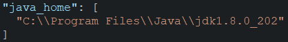

   You may also check the `readme` in `java-mutation-framework` for more information

2. In the `Microbat Preference` (`Window` -> `Preferences` -> `Microbat Debugging`), setup the required parameters:

  
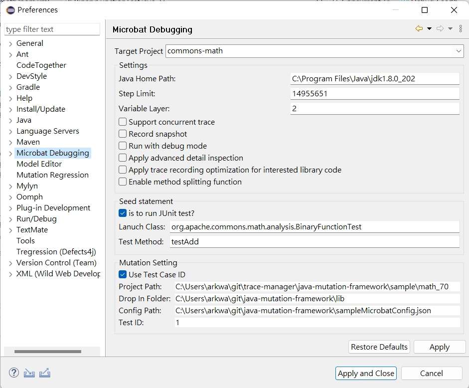

  - `Target Project`: The project that you are going to test.
  - `Launch Class`: The testing class that the test case belong to.
  - `Test Method`: Name of the test case method. Notice that the bracket is not needed.
  - `Drop In Folder`: Absolute path to the library that `Java Mutation Framework` is using. You can find the `lib` folder in the downloaded `Java Mutation Framework` with the following path `java-mutation-framework\\lib`. Notice that you need to change it to absolute path.
  - `Config Path`: Absolute path to the config `json` file. You can find it in the downloaded `Java Mutation Framework` with the following path `java-mutation-framework\\sampleMicrobatConfig.json`. Notice that you need to change it to absolute path.

#### Explaination

  `Target Project`, `Launch Class`, and `Test Method` are used to identify the target test case that you are going to test on. `Drop In Folder` and `Config Path` are the configuration used for `Java Mutation Framework`.

#### Optional Setting
  
  Instead of using `Launch Class` and `Test Method`, you can also use the `Test ID` to find out your interested test case. `Test ID` is just the order of the test case. For example, `Test ID: 0` mean the first test case of the target project.

  To use it, you need to setup the following parameter:
  - Check the `Use Test Case ID`
  - `Project Path`: Absolute path to the target project.
  - `Test ID`: Test ID of target test case

### How To Run

After setting up the configuration, you can click the `red cross button` in the tool bar to mutation the target test case.

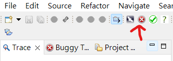

## Run with Belief Propagation

Microbat can now debug using belief prapagation technique. To know more about the belief propgation technique, please refer to paper `Debugging with Intelligence via Probabilistic Inference`.

The overall procedure is as follow:

  1. Ensure that there is a trace in the `Trace View`
  2. Start the python server for belief propagation
  3. Provided initial information about the inputs and outputs variable
  4. Repeat the following steps until the root cause is found:
      1. Run belief propagation
      2. Give feedback on the recommended trace node

The following are the step by step guideline for debugging using belief propagation:

1. Ensure that there is a trace in the `Trace View`, because Microbat will only analize the trace in the `Trace View`.

  
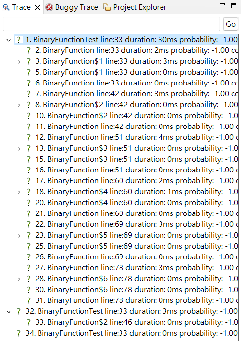

2. Since our belief propagation is implemented using python, you need to start the python server.
  
    1. Open `microbat\microbat\BP_Server\BP_Server.ipynb` using `Jupyter Notebook`
    2. Run every cell in `BP_Server.ipynb`, make sure that the `startServer()` function is running:
    
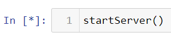

3. Provide the information of the input and output variables.

    - Input variables are the variable that you sure that is correct.
    - Output variable are the variable that you sure that is wrong.
    - For example, for the assertion such as `assertEquals(0, function(x))`, the input variable will be `x` and the output variable will be the return value of `function(x)`

    ### Select Input Variables

    - Enter the trace node that contain the input variables
    - Check all the variable that you think is correct in the `Debug Feedback View`
    - Click the `Inputs` button to submit the selection
    
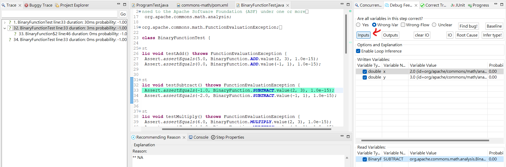

    ### Select Output Variables

    - Enter the trace node that contain the output variables
    - Check all the variable that you think is wrong in the `Debug Feedback View`
    - Click the `Outputs` button to submit the selection
    
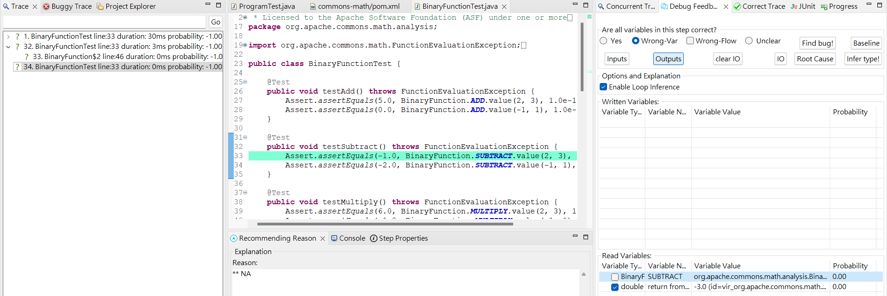

    ### Check Selected Variables

    - There is a `IO` button in `Debug Feedback View` and it will print out the selected input and output variables in console after you click it.
    
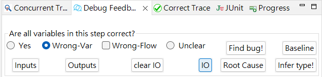

    ### Clear Selected Variables

    - There is a `Clear IO` button in `Debug Feedback View`. If you select the variable mistakenly, you need to erase all the variable by clicking this button and select again.

    
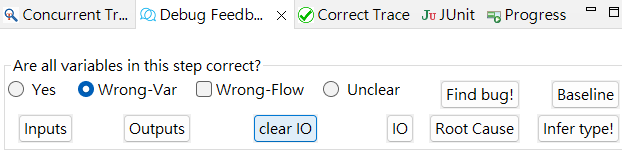

4. After selecting the input and output variable, you may click the green button on toolbar to run the belief propagation:

    
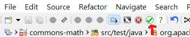

5. After getting result from the python server, Microbat will jump to the node that belief propagation think is the most posible node to be the root cause. Please give the feedback accordingly:
    - `Correct`: If the node is correct, please check the `yes` button and click the `Baseline` button to submit the feedback.
    - `Wrong Path`: If the node is in the wrong flow, please check the `Wrong-Flow` button and click the `Baseline` button to submit the feedback.
    - `Wrong Variable`: If the node contain wrong variable, please check out those wrong variable in `Variable List` and also check the `Wrong-Var` button. Finally, please click the `Baseline` button to submit the feedback
    - `Root Cause Found`: If the node turned out to be the root cause that cause the error, please click the `Root Cause` button to end the debugging process.

    
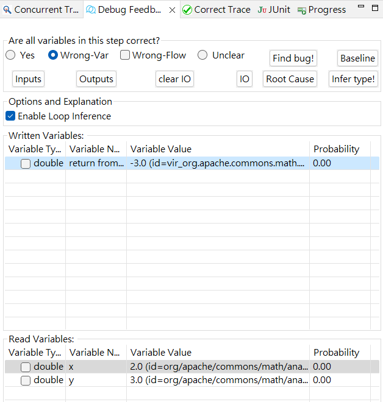

    After giving the feedback, please wait for the next result and give the feedback again if needed.

### Reference

- Debugging with Intelligence via Probabilistic Inference [link](https://dl.acm.org/doi/abs/10.1145/3180155.3180237)
- Our implementation of belief propagation is based on [krashkov](https://github.com/krashkov/Belief-Propagation.git)

