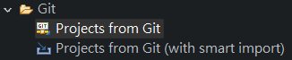
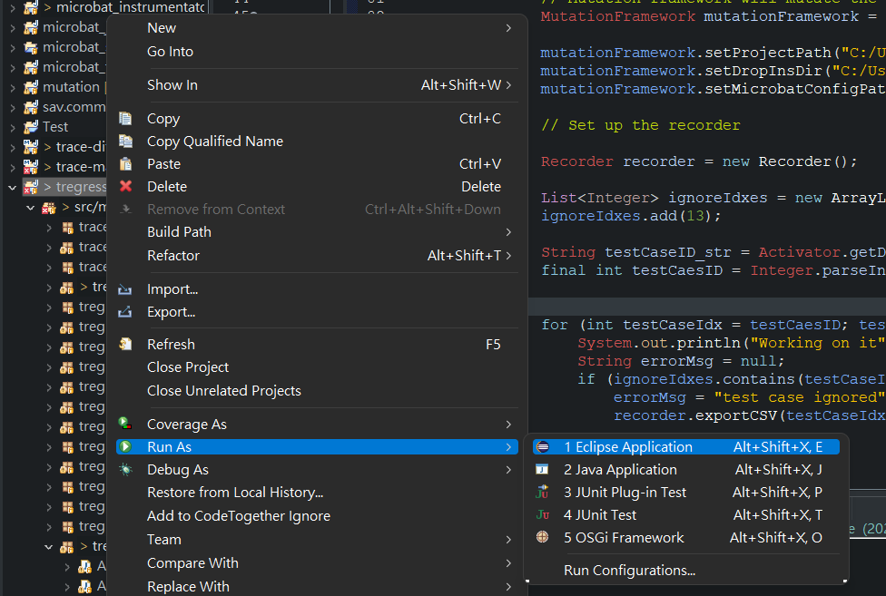
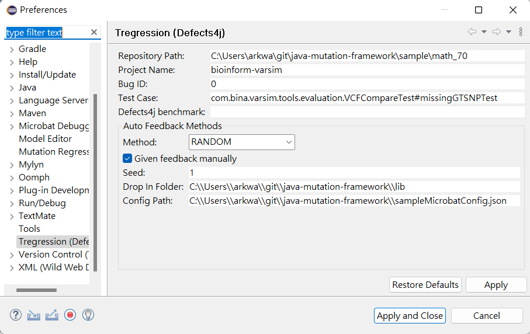
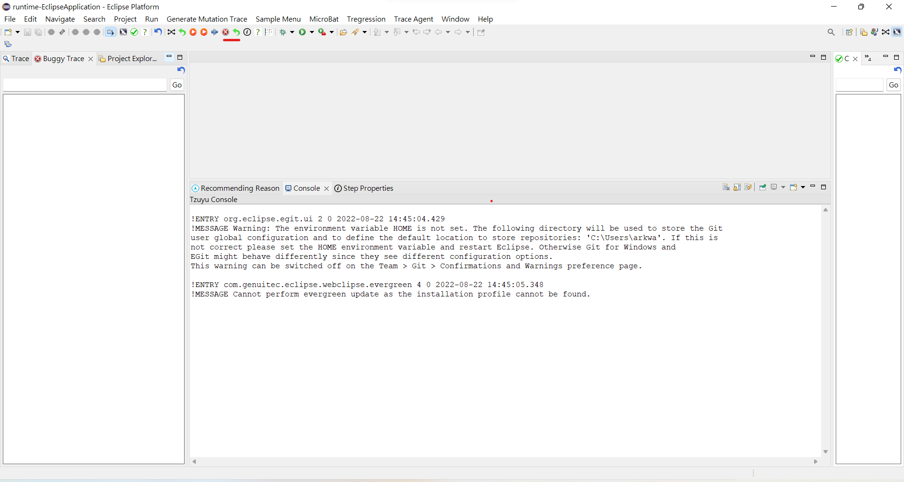
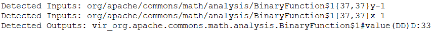
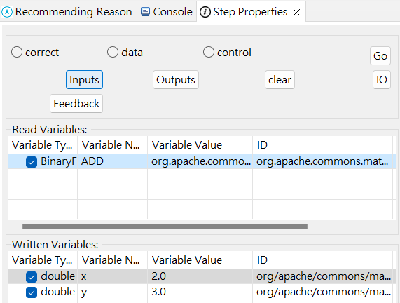
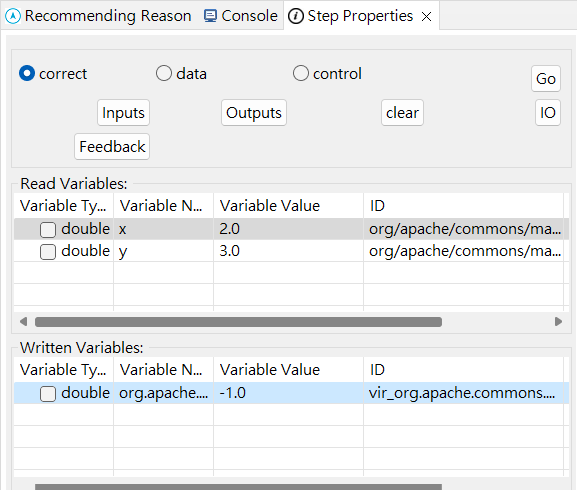
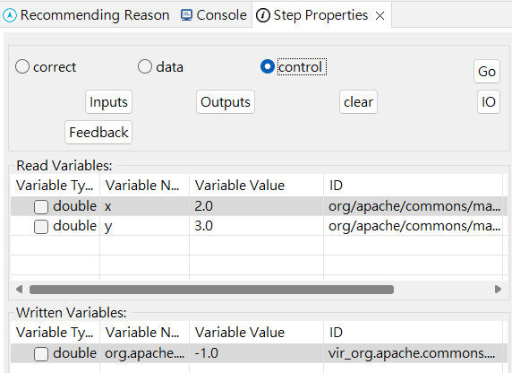
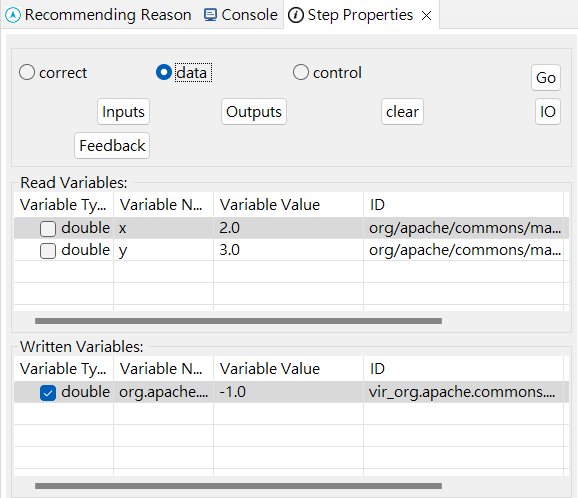

# Running Baseline (ICSE18) using Tregression and Mutation Framework

## Setup

There are a few project needed to be installed in Eclipse before running the baseline:

- `Microbat`
- `Tregression`
- `Java-Mutation-Framework`
- `Belief Propagation Python Server`

Please note that `JAVA 8` is required to run the java-mutation-framework.

In Eclipse, you can import the projects from Git.

   

1. Download the latest version of [Microbat](https://github.com/llmhyy/microbat.git) and [Tregression](https://github.com/llmhyy/tregression.git). Remember to checkout to `auto-feedback` branch

2. Download the [Java Mutation Framework](https://github.com/llmhyy/java-mutation-framework.git). Check is the following folder/file exist in the downloaded project:
   1. `java-mutation-framework\sample\`
   2. `java-mutation-framework\sampleMicrobatConfig.json`

   In `java-mutation-framework\sampleMicrobatConfig.json`, you need to verify the java home path. If the path is not valid, please change the path to the  `JAVA 8` folder eg. `C:\\Program Files\\Java\\jdk1.8.0_202`.

   

   
   

   You may also check the `readme` in `java-mutation-framework` for more information

3. Prepare python server
   - Open `microbat\microbat\BP_Server\BP_Server.ipynb` using jupyter notebook
   - Run all the cell in `BP_Server.ipynb` to set up the server

## Configuration

After setting up the projects, you need to configure the which project you want to test on. In this example, we will test the program in `math_70 `.

1. Run `Tregression` as Eclipse Application
   

   
   

2. In the toolbar, go to `Window -> Preference -> Tregression (defect4j)`
   

   
   

3. There are several setting that you need to change:

   - **Repository Path:** It is the absolute path to the testing project. The recommanded testing project are installed within `java-mutation-framework/sample`. In this example, we are using `math_70` as our testing project: `C:\Users\user_name\git\java-mutation-framework\sample\math_70`
   - **Bug ID:** It represent which test case that is being tested. For example, for `Bug ID = 0`, that mean the first test case is being tested. Make sure that the `Bug ID` does not exceed the number of test cases. In our example, we are testing the first test case so that the input is `0`.
   - **Give feedback manually:** Check this box if you want to give the feedback manually, which is also the recommanded choice. 
    
      If the box is unchecked, then tregression will give the feedback by comparing the buggy trace and correct trace. However, since some of the variable are changed for running the baseline, it is possible that tregression may give wrong feedback.

   - **Seed:** It is the random seed used by `java-mutation-framework`. By default, it is set to be `1`.
   - **Drop In Folder:** You need to specified the absolute path to drop in folder which is the `lib` folder used by `java-mutation-framework`. You can find the `lib` folder in `java-mutation-framework\\lib`. You need to convert it to absolute path.
   - **Config Path:** It is the configuration json file for instruementation. Make sure that the `JAVA 8` path is correct inside in the json file. You can find it in `java-mutation-framework\\sampleMicrobatConfig.json`. Again, you need to convert it to absolute path.

## Running Baseline

After all the configuration is set, you can test the baseline using the testing program in selected project.

1. Make sure that the python server is running
2. Click the `Read Cross` button. It will perform the mutation.
   

   
   

3. After the mutation is finished, verify the self-detected inputs and outputs variable in the console.
      

   
   

4. If the self-detected inputs and outputs variables are correct, skip this step. If they are wrong, then you need to define them manually:

   - **Define Inputs Variables**
      1. Navigate to the node that define the input variables. Note that there may be multiple node that define input variables.
      2. In the `Step Property View`, select the input varaibles and click `Inputs` button.
      

      
      

   - **Define Outputs Variables**
     1. Navigate to the node that define the output variables.
     2. In the `Step Property View`, select teh output variables and click `Outputs` button
   - **Check Selected IO**
      1. In the `Step Property View`, click the `IO` button. It will print the information of selected inputs and outputs variable in the console
   - **Clear Selected IO**
      1. If you select a wrong input or output, you need to click the `Clear` button in `Step Property View` to erase all the selected inputs and outputs, then select them again.
5. Click the `Green Go Back` button to perform belief propergation wait for the result.
6. If the recommanded node is not the root cause, the program will for feedback. You will need to give the feedback manually if you click the `manual feedback` box in the `Tregrssion Preference`.
   - **Give feedback CORRECT**
      1. In `Step Porperty View`, check the `correct` button and click the `Feedback` button to submit the feedback.
      

      
      

   - **Give feedback WRONG PATH**
     1. In `Step Porperty View`, check the `control` button and click the `Feedback` button to submit the feedback.
      

      
      

   - **Give feedback WRONG VARIABLE**
     1. In `Step Porperty View`, check the `data` button
     2. Select all the variable that you think is wrong
     3. Click the `Feedback` button to submit the feedback.
      

      
      

7. Repeat the steps until the root cause is found. Or, after giving 20 feedbacks, the program will stop and claim that root cause cannot be found. Plase note the it takes time to wait for belief propagation to converge.

## Reference

The implementation of the Belief Propagation is modified from [Belief Propagation](https://github.com/krashkov/Belief-Propagation.git)